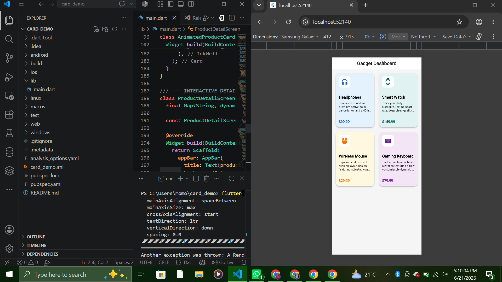

# Flutter Card Widget Dashboard Demo
A tiny demo app describing a card widget in the real world
This card widget is built with a flexible UI grid dashboard built to showcase how the Flutter `Card` widget organizes, styles, and presents content across real-world application workflows.

---
It is presented mostly as an interactive e-commerce gadget dashboard. 
## How to Run the Project

You can follow these terminal steps to launch the workspace locally:
You can navigate through the code and make some changes for validation.
1. Clone this repository and open the project directory:
   ```bash
   git clone https://github.com/NMordecai/card_demo.git
   cd card_demo

   ## UI Layout Screenshot


